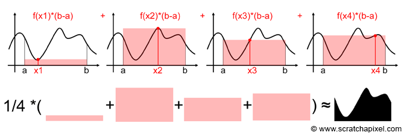

---
jupytext:
  cell_metadata_filter: all
  encoding: '# -*- coding: utf-8 -*-'
  formats: ipynb,py:percent,md:myst
  notebook_metadata_filter: all,-language_info,-toc,-latex_envs
  text_representation:
    extension: .md
    format_name: myst
    format_version: 0.13
    jupytext_version: 1.11.0
kernelspec:
  display_name: Python 3
  language: python
  name: python3
---

+++ {"slideshow": {"slide_type": "slide"}}


# What I wish I'd known about statistics


+++ {"slideshow": {"slide_type": "slide"}}

## Probability is a subtle concept

Money quote:  "I must premiss that we, all of us, use this word ["probability"] with a degree of laxity which corrupts and rots our reasoning to a degree that very few of us are at all awake to." [Charles S. Pierce, 1910](https://philpapers.org/rec/BURIUW)

[Fermat-Pascal letters (1654)](https://www.aps.org/publications/apsnews/200907/physicshistory.cfm)

[Laplace and Bayes (1754)](https://www.lesswrong.com/posts/RTt59BtFLqQbsSiqd/a-history-of-bayes-theorem)

+++ {"slideshow": {"slide_type": "slide"}}

[Kolmogorov Axioms (1933)](https://plato.stanford.edu/entries/probability-interpret/#KolProCal): 

i)  0 ≤ p(E) ≤ 1.  

ii) the certain event has probability 1  

iii) The probability of the union of mutually exclusive events is the sum of the probabilities of the individual events.    

+++ {"slideshow": {"slide_type": "slide"}}

All of these interpretations are consistent with these axioms: 

<ul>

 <li><a href="https://plato.stanford.edu/entries/probability-interpret/#ClaPro">3.1 Classical Probability</a></li>
 
 <li><a href="https://plato.stanford.edu/entries/probability-interpret/#LogPro">3.2 Logical/Evidential Probability</a></li>
 
 <li><a href="https://plato.stanford.edu/entries/probability-interpret/#SubPro">3.3 Subjective Probability</a></li>
 
 <li><a href="https://plato.stanford.edu/entries/probability-interpret/#FreInt">3.4 Frequency Interpretations</a></li>
 
 <li><a href="https://plato.stanford.edu/entries/probability-interpret/#ProInt">3.5 Propensity Interpretations</a></li>
 
 <li><a href="https://plato.stanford.edu/entries/probability-interpret/#BesSysInt">3.6 Best-System Interpretations</a></li>
 </ul></li>

 <li><a href="https://plato.stanford.edu/entries/probability-interpret/#ConFutPro">4. Conclusion: Future Prospects?</a>
 
<ul>

+++

## Bayes theorem

Bayes theorem gives the formula for computing conditional probabilities.  This formula applies regardless of your definition of probability, as long as it obeys Kolmogorov's axioms.

[A famous example](https://www.ncbi.nlm.nih.gov/pmc/articles/PMC4818954/)

+++ {"slideshow": {"slide_type": "slide"}}

## [Frank Harrell on Bayes](https://www.fharrell.com/post/journey/)

If you tossed a coin 100 times resulting in 60 heads, would you rather know the probability of getting > 59 heads out of 100 tosses if the coin happened to be fair, or the probability it is fair given exactly 60 heads? The frequentist approach is alluring because of the minimal work in carrying out a test of the null hypothesis θ=½. But the Bayesian approach provides a direct answer to the second question, and requires you to think. What is an “unfair” coin? Is it θ outside of [0.49, 0.51]? What is the world view of coins, e.g., is someone likely to provide a coin that is easily detectable as unfair because its θ=0.6? Was the coin chosen at random or handed to us?


+++ {"slideshow": {"slide_type": "slide"}}

and for the [correlation coefficient](https://baezortega.github.io/2018/05/28/robust-correlation/) the statements would be something like:

**Bayes**: According to the model, the correlation coefficient is between -0.83 and -0.98 with 99% probability

**Frequentist**: According to the test, we are 95% confident that the correlation coefficient has a value somewhere between -0.51 and -0.99; we don’t really know if this interval contains the value, but if we could repeat this analysis on infinite different samples, we would be wrong just 5% of the time!

+++ {"slideshow": {"slide_type": "slide"}}

## What about probability of precipitation?

* [UK Met. Office forecaster guidance (pdf p. 141)](https://www.weather.gov/media/zhu/ZHU_Training_Page/Met_Tutorials/Forecasters_Reference_Book_1997.pdf)

**11.1.1 Interpretation of probabilities**

Probabilities can be interpreted in two ways:

(i) Relative frequency interpretation.

(ii) Subjective interpretation.


+++ {"slideshow": {"slide_type": "subslide"}}

UK Met. Office continued:

Thus consider a 'probability of precipitation (PoP) forecast of 30%':

(i) Relative interpretation: the present meteorological situation, observed on a large number
    of occasions, would give rise to precipitation on 30% of the time.

(ii) Subjective interpretation: the forecaster's judgment is that the odds against
     precipitation are 7 to 3 (odds against no precipitation being 3 to 7). Generally, if p is the
     probability, the odds against the event are: (1/p - 1) to 1.  (Ed. note -- see [hartleys and decibans](https://en.wikipedia.org/wiki/Hartley_(unit) ) )
     
(iii) The subjective interpretation gives a practical way of thinking about probabilities.

**So what's a graduate student to do?**

+++ {"slideshow": {"slide_type": "slide"}}

## Case study: linear regression two ways

### Frequentist first, following [Hogg et al., 2010](https://arxiv.org/abs/1008.4686)

"It is a miracle with which we hope everyone reading this is familiar that if you have a set of two-dimensional points (x, y) that depart from a perfect, narrow, straight line y = m x + b only by the addition of Gaussian distributed noise of known amplitudes in the y direction only, then the maximum-likelihood or best-fit line for the points has a slope m and intercept b that can be obtained justifiably by a perfectly linear matrix-algebra operation known as “weighted linear least-square fitting”. This miracle deserves contemplation."

+++ {"slideshow": {"slide_type": "slide"}}

## The math, following: [Fleshman, 2019](https://towardsdatascience.com/linear-regression-91eeae7d6a2e)


The generating process:

$$
y = \theta_1 x + \theta_0 + \epsilon
$$
where $\epsilon$ is normally distributed with mean $\mu=0$ and standard deviation $\sigma$.

This means that the conditional (frequentist) probability that we make an observation $y$ given $x$ is to:

$$
p\left(y | x ; \theta_{0}, \theta_{1}, \sigma^{2}\right)=\frac{1}{\sqrt{2 \pi \sigma^{2}}} e^{\frac{-\left(y-(\theta_{1} x + \theta_{0})\right)^{2}}{2 \sigma^{2}}}
$$

Since the data points are assumed to be independent, their probabilities multiply, and we define the **likelihood** of observing the data given the parameters $(\theta_0,\theta_1,\sigma)$ as:
$$
L_{X}\left(\theta_{0}, \theta_{1}, \sigma^{2}\right)=\frac{1}{\sqrt{2 \pi \sigma^{2}}} \prod_{(x, y) \in X} e^{\frac{-\left(y-(\theta_{1} x +\theta_{0})\right)^{2}}{2 \sigma^{2}}}
$$

+++ {"slideshow": {"slide_type": "slide"}}

## Maximum likelihood

Solve this for the set of parameters that give the **maximum likelihood** by taking the $\log$ and finding the maximum by setting the derivative = 0 and solving for $(\theta_0, \theta_1)$.  This gives you the usual relationship for the slope and intercept in terms of the data statistics ($\overline{x}$,$\overline{y}$).  Note that we don't need to know $\sigma$, because we're assuming it's constant.

$$
l_{X}\left(\theta_{0}, \theta_{1}, \sigma^{2}\right)=\log \left[\frac{1}{\sqrt{2 \pi \sigma^{2}}} \prod_{(x, y) \in X} e^{\frac{-\left(y-\left(\theta_{1} x+\theta_{0}\right)\right)^{2}}{2 \sigma^{2}}}\right]
$$

$$
=-\log (\sqrt{2 \pi \sigma^{2}})-\frac{1}{2 \sigma^{2}} \sum_{(x, y) \in X}\left[y-\left(\theta_{1} x+\theta_{0}\right)\right]^{2}
$$
$$
\hat{y}=\theta_{1} x+\theta_{0}
$$

$$
\theta_{0}=\overline{y}-\theta_{1} \overline{x}
$$
$$
\theta_{1}=\frac{\sum_{i}^{n}\left(x_{i}-\overline{x}\right)\left(y_{i}-\overline{y}\right)}{\sum_{i}^{n}\left(x_{i}-\overline{x}\right)^{2}}
$$

+++ {"slideshow": {"slide_type": "slide"}}

## Code this up

A couple of lines of python

```{code-cell} ipython3
---
slideshow:
  slide_type: subslide
---
import numpy as np
from matplotlib import pyplot as plt
import pandas as pd

def find_line(xs, ys):
    """Calculates the slope and intercept"""
    
    # number of points
    n = len(xs)
    # calculate means
    x_bar = sum(xs)/n
    y_bar = sum(ys)/n
        
    # calculate slope
    num = 0
    denom = 0
    for i in range(n):
        num += (xs[i]-x_bar)*(ys[i]-y_bar)
        denom += (xs[i]-x_bar)**2
    slope = num/denom
    
    # calculate intercept
    intercept = y_bar - slope*x_bar
    
    return slope, intercept
```

+++ {"slideshow": {"slide_type": "slide"}}

## Use it to find $\theta_0, \theta_1$

### First create 200 simulated measurements using the model

```{code-cell} ipython3
---
slideshow:
  slide_type: subslide
---
size = 200
true_intercept = 1
true_slope = 2
true_sigma = 0.5

x = np.linspace(0, 1, size)
# y = a + b*x
true_regression_line = true_intercept + true_slope * x
# add noise
y = true_regression_line + np.random.normal(scale=true_sigma, size=size)

data = dict(x=x, y=y);
```

+++ {"slideshow": {"slide_type": "slide"}}

## Plot the data with the true regression line

```{code-cell} ipython3
---
slideshow:
  slide_type: subslide
---
fig = plt.figure(figsize=(7, 7))
ax = fig.add_subplot(111, xlabel='x', ylabel='y', title='Generated data and underlying model')
ax.plot(x, y, 'x', label='sampled data')
ax.plot(x, true_regression_line, label='true regression line', lw=2.)
plt.legend(loc=0);
```

+++ {"slideshow": {"slide_type": "slide"}}

## Compare the true and estimated (green) regression lines

```{code-cell} ipython3
---
slideshow:
  slide_type: subslide
---
slope, intercept = find_line(x,y)
fit_y = intercept + slope * x
ax.plot(x, fit_y)
display(fig)
```

+++ {"slideshow": {"slide_type": "slide"}}

## Use bootstrap resampling to estimate confidence intervals

```{code-cell} ipython3
---
slideshow:
  slide_type: subslide
---
def draw_bs_pairs_linreg(x, y, size=1):
    """Perform pairs bootstrap for linear regression."""

    # Set up array of indices to sample from: inds
    inds = np.arange(len(x))

    # Initialize replicates: bs_slope_reps, bs_intercept_reps
    bs_slope_reps = np.empty(size)
    bs_intercept_reps = np.empty(size)

    # Generate replicates
    for i in range(size):
        bs_inds = np.random.choice(inds, size=len(inds))
        bs_x, bs_y = x[bs_inds], y[bs_inds]
        #
        # use np.polyfit for order 1 linear model
        #
        bs_slope_reps[i], bs_intercept_reps[i] = np.polyfit(bs_x, bs_y, 1)

    return bs_slope_reps, bs_intercept_reps
```

+++ {"slideshow": {"slide_type": "slide"}}

## Plot 100 different regression lines

```{code-cell} ipython3
---
slideshow:
  slide_type: subslide
---
slopes, intercepts = draw_bs_pairs_linreg(x, y, size=100)
for the_slope,the_intercept in zip(slopes,intercepts):
    fit_y = the_intercept + the_slope * x
    ax.plot(x, fit_y)
display(fig)
```

+++ {"slideshow": {"slide_type": "slide"}}

## Histogram resampled $\theta_0$ and $\theta_1$

```{code-cell} ipython3
---
slideshow:
  slide_type: subslide
---
fig, ax = plt.subplots(1,2,figsize=(12,6))
ax[0].hist(slopes); ax[0].set_title("slopes");
ax[1].hist(intercepts);ax[1].set_title("intercepts");
```

+++ {"slideshow": {"slide_type": "slide"}}

## What's wrong with this workflow?

1. No way to introduce uncertainty in x

1. Unrealistically simple uncertainty in y (constant $\sigma$)

1. Can't make statements as frequentists about uncertainty in $\theta_0, \theta_1$

1. Can't deal with outliers (robust regression)

+++ {"slideshow": {"slide_type": "slide"}}

## Take 2: The Bayesian version

Start with Bayes theorem, given the logical/subjective definition of probability:

\begin{align}
\underbrace{p(\text{proposition} | data)}_{\text{posterior probability}} & \propto 
  \underbrace{p(data | \text{proposition} )}_{likelihood} \times
  \underbrace{p(\text{proposition})}_{\text{prior probability}}
\end{align}

The likelhood is exactly the same as the frequentist version:

$$
p(y | \theta_{0}, \theta_{1}, \sigma^{2} ) \propto \left[\frac{1}{\sqrt{2 \pi \sigma^{2}}} \prod_{(x, y) \in X} e^{\frac{-\left(y-\left(\theta_{1} x+\theta_{0}\right)\right)^{2}}{2 \sigma^{2}}}\right]
$$

Note that the Bayesian version makes clear that the likelihood is a function of the data for a fixed set
of generating function parameters.

+++ {"slideshow": {"slide_type": "slide"}}

## What to do about $p(\text{proposition})$ -- the prior probability

1.  Take $p(\theta_1)$ and $p(\theta_0)$ as normally distributed with mean=0 and $\sigma = 20$

1.  Take $p(\sigma)$ as [Halfcauchy](https://docs.pymc.io/api/distributions/continuous.html#pymc3.distributions.continuous.HalfCauchy) with $\beta=10$

1.  Again, assume independence, so prior is $p(\theta_1) \times p(\theta_0) \times p(\sigma)$

Essentially, we want to "let the data speak" so these are quite flat distributions that don't put any real preconditions on acceptable values for $\theta_0, \theta_1, \sigma$.

+++ {"slideshow": {"slide_type": "subslide"}}

So Bayes rule says:

$$
p( \theta_{0}, \theta_{1}, \sigma^{2} | y ) \propto \left[\frac{1}{\sqrt{2 \pi \sigma^{2}}} \prod_{(x, y) \in X} e^{\frac{-\left(y-\left(\theta_{1} x+\theta_{0}\right)\right)^{2}}{2 \sigma^{2}}}\right] \times p(\theta_1) \times p(\theta_0) \times p(\sigma)
$$

and we can get, for example the pdf of $\sigma^2$ by marginalization:

$$
p(\sigma^{2}) \propto \int \int p( \theta_{0}, \theta_{1}, \sigma^{2} | y )\, d \theta_0 \, d \theta_1
$$

+++ {"slideshow": {"slide_type": "subslide"}}

## How to solve this integral?

[Hamiltonian Markov Chain Montecarlo](https://arxiv.org/pdf/1206.1901.pdf)

A (very) fancy version of naive Monte Carlo integration:



+++ {"slideshow": {"slide_type": "slide"}}

## Code this using pymc3

```{code-cell} ipython3
---
slideshow:
  slide_type: slide
---
import pymc3 as pm
with pm.Model() as model: # model specifications in PyMC3 are wrapped in a with-statement
    # Define priors
    sigma = pm.HalfCauchy('sigma', beta=10, testval=1.)
    intercept = pm.Normal('Intercept', 0, sigma=20)
    slope = pm.Normal('slope', 0, sigma=20)
    
    # Define likelihood
    likelihood = pm.Normal('y', mu=intercept + slope * x, 
                        sigma=sigma, observed=y)
    
    # Inference!
    trace = pm.sample(3000, cores=8, tune=2000) # draw 3000 posterior samples using NUTS sampling
```

```{code-cell} ipython3
---
slideshow:
  slide_type: slide
---
axes=pm.plot_trace(trace[100:],figsize=(12, 7));
```

```{code-cell} ipython3
---
slideshow:
  slide_type: slide
---
plt.figure(figsize=(7, 7))
plt.plot(x, y, 'rx', label='data')
generating_fun = lambda x, sample: sample['Intercept'] + sample['slope'] * x
pm.plot_posterior_predictive_glm(trace, lm=generating_fun, samples=100, 
                              label='posterior predictive regression lines')
plt.plot(x, true_regression_line, label='true regression line', lw=3., c='y')

plt.title('Posterior predictive regression lines')
plt.legend(loc=0)
plt.xlabel('x')
plt.ylabel('y');
```

+++ {"slideshow": {"slide_type": "slide"}}

## Well, that seemed complicated -- but worth it?

Advantages:

1. Estimate of $\sigma$

1. Distributions instead of single numbers for $\theta_0$ and $\theta_1$

1. Actual (Bayesian) uncertainty estimates for all three parameters

1. We can check the model against new data ("posterior predictive checks")

1. Flexible approach generalizes to any generating function we can write in 
   terms of distributions.
   
   1. Example:  [Robust regression](https://docs.pymc.io/notebooks/GLM-robust.html)

   1. Example: [Robust correlation](https://baezortega.github.io/2018/05/28/robust-correlation/)
   
   1. Example: [the pymc3 gallery](https://docs.pymc.io/nb_examples/index.html)

+++ {"slideshow": {"slide_type": "slide"}}

## Bottom line

* Frequentists -- data-oriented, controlled clinical trials with preregistration, lab scientists
  - all about the sample space
  
* Bayesians -- more model oriented, often interested in parameter estimation, understanding the 
  data generating process (i.e., our tribe for many in EOAS)
  
* All of this is distinct from null hypothesis testing/p-values/Bayes factors, which
  when used naively have created replication issues in some research communities.
  Pithy summary from Gelman: [The difference between significant and insignificant is not statistcially significant](http://www.stat.columbia.edu/~gelman/research/published/signif4.pdf)

* In 1983 I needed [Hierarchical Bayesian Regression](https://docs.pymc.io/notebooks/GLM-hierarchical.html), I was too early by about a decade.

* Bayesian updating via Bayes rule, and the logical/subjective interpretation of probability is closely connected to machine learning

+++ {"slideshow": {"slide_type": "slide"}}

## Coda:  An example of the debate on Bayesian model comparison

* [To Bayes or not to Bayes](https://www.dropbox.com/s/3vw85dkr506yxag/to_bayes_or_not.pdf?dl=0) -- Scales and Sneider (1997)

* [Gelman and Shalizi's answer to those issues](http://www.stat.columbia.edu/~gelman/research/published/philosophy.pdf) -- posterior predictive checking

+++ {"slideshow": {"slide_type": "slide"}}

## Further reading -- all books available online through the UBC library

* [Statistical rethinking](https://www.oreilly.com/library/view/statistical-rethinking/9781482253481/?ar)
 
  - Great read by the Richard McElreath, director of the Max Planck Institute for Evolutionary Anthropology -- well written and very accessible -- nice treatment on the connection between statistics and information theory
  
  - [SR and other python source code for stats texts](https://github.com/pymc-devs/resources)

* [Statistics, data mining and machine learning in astronomy](https://www.degruyter.com/viewbooktoc/product/459330)

  - Lots of pertinent examples from 4 astronomers -- closely related to our typical research problems
  
  - [SDMLA github repository](https://github.com/astroML/astroML)
  
  - Related article by one of the co-authors:
  
    - [Frequentism and Bayesianism: A python-driven primer, Jake Vanderplas 2014](https://arxiv.org/pdf/1411.5018.pdf)

* [Bayesian analysis with python](http://gw2jh3xr2c.search.serialssolutions.com/?sid=sersol&SS_jc=TC_034362911&title=Bayesian%20Analysis%20with%20Python%20-%20Second%20Edition)

  - Best intro to pymc3

  - [BAP source code](https://github.com/aloctavodia/BAP)

* [Hogg et al. Fitting a model to data](https://arxiv.org/abs/1008.4686)  -- motivation for the regression example in this talk -- read the footnotes

* [Hogg et al. on conditional probability](https://arxiv.org/pdf/1205.4446v1.pdf) -- pdfs have units!

* [Gelman's blog](https://statmodeling.stat.columbia.edu/)  -- [a representative post](https://statmodeling.stat.columbia.edu/2015/01/27/perhaps-merely-accident-history-skeptics-subjectivists-alike-strain-gnat-prior-distribution-swallowing-camel-likelihood/
)

* [David Hogg's blog](http://hoggresearch.blogspot.com/) -- [a representative post](http://hoggresearch.blogspot.com/2019/09/how-to-model-empirical-abundance-space.html)

* Galleys of the 2nd edition of Kevin Murphy's "Machine Learing: A probabilistic perspective".  Good advanced undergrad grad textbook with great appendices:  [murphy_pm1.pdf](https://www.dropbox.com/s/nf3lwlohsg07u7w/murphy_pm1.pdf?dl=0).  [python code](https://github.com/probml/pyprobml)

```{code-cell} ipython3

```
