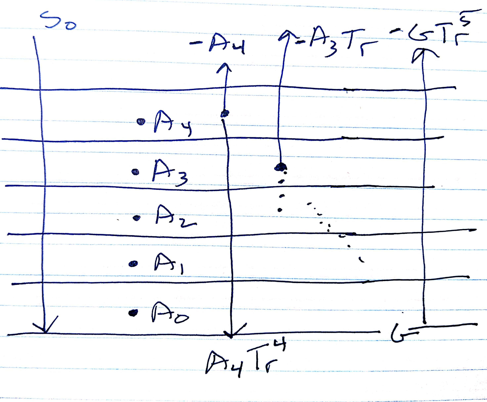
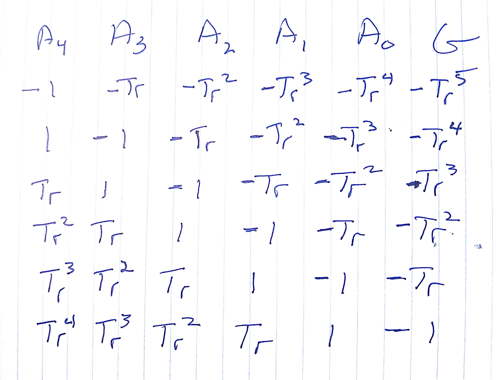

---
jupytext:
  formats: ipynb,md:myst
  text_representation:
    extension: .md
    format_name: myst
    format_version: 0.12
    jupytext_version: 1.6.0
kernelspec:
  display_name: Python 3
  language: python
  name: python3
---

(nb:multi-layer)=
# Radiative equilibrium

This script calculates pure radiative equilbrium for an nlayer atmosphere over a black surface, where
each layer has identical transmissivity and the total atmospheric 

```{code-cell} ipython3
import numpy as np
from numpy.linalg import solve
np.set_printoptions(precision=2, threshold=50)
```

## Five layer atmosphere

Let $A_n$ be the flux from layer n and $G$ be the flux from the black surface.  If upward fluxes are
negative and downward fluxes are positive, the the flux at each of the six levels in this problem
are shown in the sketch below, where $Tr = \exp(-\tau)$ is the longwave transmissivity of each layer.

+++



+++

That produces a matrix $M$ which looks like this:

+++



+++

## Creating the matrix equation

The idea is to solve the equilibrium problem as six equations in six unknowns,
where the unknowns are 

$$\vec{E} = \left [A_4, A_3, A_2, A_1, A_0, G \right ]$$

and the at each level, we need to have an upward flux of
$\vec{S_0} = \left [ -S_0, -S_0, -S_0, -S_0, -S_0 , -S_0 \right ]$ to balance
the downwelling shortwave flux at that level.

$$
M \times \vec{E} = \vec{S_0}
$$

+++

## five layer example

The off-diagonal elements will be created with the numpy.diag function which
requires a vector v of the proper length, and the number of the diagonal, $k$.

```{code-cell} ipython3
help(np.diag)
```

* Here are the k values for the matrix

```{code-cell} ipython3
nlayers=5
kvals = np.arange(nlayers,-(nlayers+1),-1,dtype=int)
kvals
```

* Set the total transmissivity to 0.2, and split it evenly among five layers

```{code-cell} ipython3
tot_trans=0.2
log_layer_trans = np.log(tot_trans)/nlayers
trans = np.exp(log_layer_trans)
print(f"{(trans**nlayers)=:5.3f}")
```

* create all the off-diagonal elements of the matrix $M$.

```{code-cell} ipython3
import pprint
pp = pprint.PrettyPrinter(indent=4)

def find_diaglen(kvals,nlayers):
    nlevels=kvals[0] + 1
    keep_len=[]
    for the_k in kvals:
        if the_k >=0:
            diaglen = nlevels - the_k
        else:
            diaglen = nlevels+the_k
        keep_len.append(diaglen)
    return keep_len

def find_element(kvals,diaglen,trans):
    nlevels=kvals[0] + 1
    element_dict={}
    for the_k,the_len in zip(kvals,diaglen):
        if the_k >= 0:
            direction = -1
            the_exp=the_k
        else:
            direction = 1
            the_exp=-(the_k+1)
        the_element=(trans**the_exp)*direction
        element_dict[the_k] = {'element':the_element,
                               'exponent':the_exp,'diaglen':the_len}
    return element_dict
            
```

```{code-cell} ipython3
diaglen = find_diaglen(kvals,nlayers)
element_dict=find_element(kvals,diaglen,trans)
pp.pprint(element_dict)
all_keys=list(element_dict.keys())
print(all_keys[0])
```

```{code-cell} ipython3
def build_matrix(element_dict):
    num_rows = list(element_dict.keys())[0] + 1
    the_mat = np.zeros([num_rows,num_rows])
    for the_k,the_dict in element_dict.items():
        diaglen=the_dict['diaglen']
        the_element=the_dict['element']
        the_diag=np.full(shape=diaglen,fill_value=the_element)
        diag_mat = np.diag(the_diag,k=the_k)
        the_mat+=diag_mat
    return the_mat
```

```{code-cell} ipython3
A = build_matrix(element_dict)
S0= -240
rhs = np.full(shape=nlayers+1,fill_value=S0)
fluxes = solve(A,rhs)
A
```

```{code-cell} ipython3
fluxes
```

```{code-cell} ipython3
def calc_temps(fluxes,trans,nlayers):
    sigma = 5.67e-8
    eps = 1 - trans
    eps_vec=[trans]*nlayers
    eps_vec.extend([1])
    temps=[]
    for a_flux, the_eps in zip(fluxes,eps_vec):
        the_temp = (a_flux/(sigma*the_eps))**0.25
        temps.append(the_temp)
    return np.array(temps)
```

```{code-cell} ipython3
calc_temps(fluxes,trans,nlayers)
```
